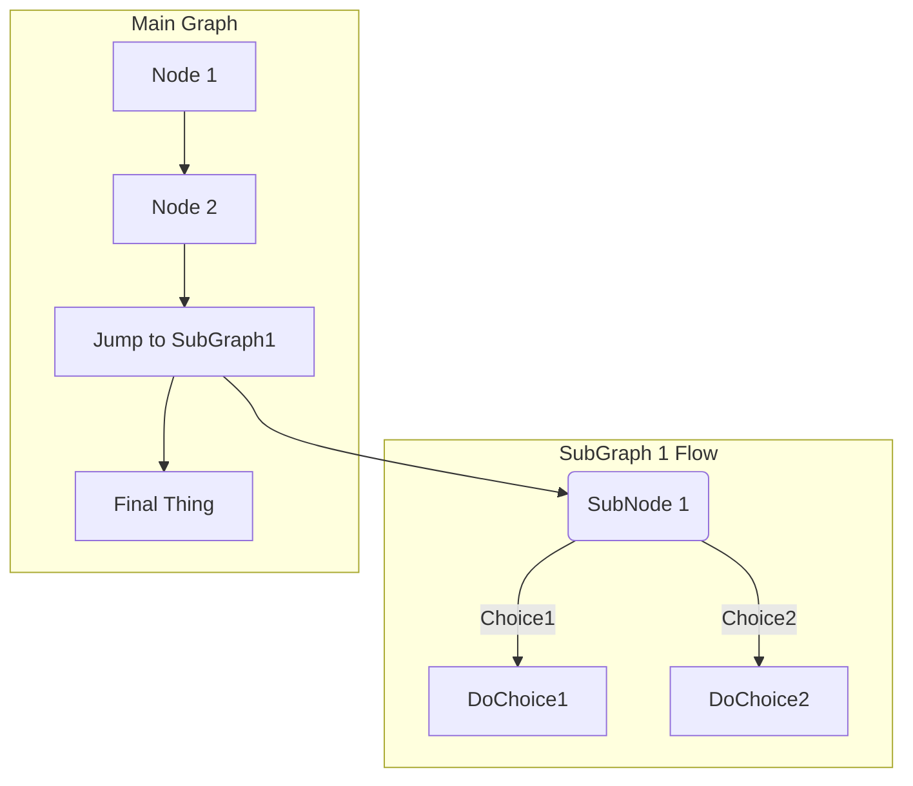

<head>
  <script src="https://cdnjs.cloudflare.com/ajax/libs/mermaid/8.0.0/mermaid.min.js"></script>
  <!-- <script src="https://cdn.jsdelivr.net/npm/mermaid/dist/mermaid.min.js"></script> -->
  <script type="text/javascript" async src="//cdn.mathjax.org/mathjax/latest/MathJax.js?config=TeX-MML-AM_CHTML"></script>
</head>

Big shoutout to [Dean Attali (daattali)](https://github.com/daattali) for making
this all this possible with
[beautiful-jekyll](https://github.com/daattali/beautiful-jekyll). This is the
start of my documentation journey.

# Single Hash Heading {#custom-id}
This is a collection of markdown for quick referencing. [^1] Markdown is useful.
It helps write `HTML code` with _simplicity_. [^footnote-42]

Unfortunately, some of these features may not work outside of GitLab. And also,
some of these features only work in the blog (mermaid and mathjax scripts in
head). You can use GitLab Flavored Markdown in the following areas:

* Comments
* Issues
* Merge requests
* Milestones
* Snippets (the snippet must be named with a .md extension)
* Wiki pages
* Markdown documents inside repositories
* Epics (ULTIMATE)

[Gitlab Example](https://gitlab.com/gitlab-org/gitlab/blob/master/doc/user/markdown.md)

[^1]: Footnote 1 is just mentioning that I started with
[md guide's cheat sheet](https://www.markdownguide.org/cheat-sheet/).

[^footnote-42]: Tehe.

---

**Embolden yourself with two asterisks and also knowledge!**

## Second heading with 2 hashes

Here's a ~~striking~~ly good table:

| Number | Color?(jk) | Other |
| :--- | :------: | ---: |
| Five | `#FF0000AA` | Hey |
| 100 | `RGB(0,255,0)` | Ho |
| Seven | `RGB(0%,100%,0%)` | Watch it |
| 999 | `RGBA(0,255,0,0.3)` | Flow |

How do you like them apples? <br> Mm yeah.

---

### Inline Media


It can also be centered!

{: .mx-auto.d-block :}

<a href="http://www.youtube.com/watch?feature=player_embedded&v=VOC3huqHrss
" target="_blank"></a>

### Checklist
1. [x] Just going to have to make do with what you can.
1. [ ] But know that there is a great beyond.
   * [ ] For which, you can explore.
   * [x] Uses markdown: [kramdown](https://kramdown.gettalong.org/syntax.html)
          in YAML

### Code Blocks
Highlighted code block:

```json
{
  "firstName": "John",
  "lastName": "Smith",
  "age": 25
}
```

```javascript
var foo = function(bar) {
  return(bar + 5);
}
foo(3)
```

And here is the same code yet again but with line numbers:


var foo = function(x) {
  return(x + 5);
}
foo(3)


### Boxes
> Add all sorts of stuff.
> Boxes, notifications, warnings and errors galore.

### Notification

{: .box-note}
**Note:**  Adding a note here to tell you about notes.

 - {+ Do add color +}
 - [- but be afraid -]
 - [+ of errors +]
 - {- :tongue: -}

### Warning

{: .box-warning}
**Warning:** Take your time, Hurry up! :snail:

### Error

{: .box-error}
**Error:**
Don't use these: [Emoji List](https://gist.github.com/rxaviers/7360908)

:speak_no_evil:

## Math
$$
\begin{aligned}
  & \phi(x,y) = \phi \left(\sum_{i=1}^n x_ie_i, \sum_{j=1}^n y_je_j \right)
  = \sum_{i=1}^n \sum_{j=1}^n x_i y_j \phi(e_i, e_j) = \\
  & (x_1, \ldots, x_n) \left( \begin{array}{ccc}
      \phi(e_1, e_1) & \cdots & \phi(e_1, e_n) \\
      \vdots & \ddots & \vdots \\
      \phi(e_n, e_1) & \cdots & \phi(e_n, e_n)
    \end{array} \right)
  \left( \begin{array}{c}
      y_1 \\
      \vdots \\
      y_n
    \end{array} \right)
\end{aligned}
$$

## Diagrams / Flowcharts

<div class="mermaid">
graph TD
  SubGraph1 --> SubGraph1Flow
  subgraph "SubGraph 1 Flow"
  SubGraph1Flow(4B. If you're)
  SubGraph1Flow -- Not --> Greedy
  SubGraph1Flow -- You Will --> Go Far
  end

  subgraph "Main Graph"
  Node1[1. Oompa] --> Node2[2. Loompa]
  Node2 --> SubGraph1[3. Doompety (Jump to SubGraph1]
  SubGraph1 --> FinalThing[4A. Da]
  end
</div>

<div class="mermaid">
  SubGraph1 --> SubGraph1Flow
  subgraph "SubGraph 1 Flow"
  SubGraph1Flow(4B. If you're)
  SubGraph1Flow -- Not --> Greedy
  SubGraph1Flow -- You Will --> Go Far

  subgraph "Main Graph"
  Node1[1. Oompa] --> Node2[2. Loompa]
  Node2 --> SubGraph1[3. Doompety (Jump to SubGraph1]
  SubGraph1 --> FinalThing[4A. Da]
</div>

<div class="mermaid">
  SubGraph1 --> SubGraph1Flow
  subgraph "SubGraph 1 Flow"
  SubGraph1Flow(4B. If you're)
  SubGraph1Flow -- Not --> Greedy
  SubGraph1Flow -- You Will --> Go Far
  end

  subgraph "Main Graph"
  Node1[1. Oompa] --> Node2[2. Loompa]
  Node2 --> SubGraph1[3. Doompety (Jump to SubGraph1]
  SubGraph1 --> FinalThing[4A. Da]
  end
</div>

<div class="mermaid">
graph TD;
    A-->B;
    A-->C;
    B-->D;
    C-->D;
</div>


@startmermaid
pie title Pets adopted by volunteers
"Dogs" : 386
"Cats" : 85
"Rats" : 35
@endmermaid





<div class="mermaid">
graph TD
    A[Christmas] -->|Get money| B(Go shopping)
    B --> C{Let me think}
    C -->|One| D[Laptop]
    C -->|Two| E[iPhone]
    C -->|Three| F[fa:fa-car Car]
</div>


<div class="mermaid">
gantt
       dateFormat  YYYY-MM-DD
       title Adding GANTT diagram functionality to mermaid

       section A section
       Completed task            :done,    des1, 2021-01-06, 2021-01-08
       Active task               :active,  des2, 2021-01-09, 3d
       Future task               :         des3, after des2, 5d
       Future task2              :         des4, after des3, 5d

       section Critical tasks
       Completed task in the critical line :crit, done, 2021-01-06, 24h
       Implement parser and jison          :crit, done, after des1, 2d
       Create tests for parser             :crit, active,           3d
       Future task in critical line        :crit, 5d
       Create tests for renderer           :2d
       Add to mermaid                      :1d

       section Documentation
       Describe gantt syntax               :active, a1, after des1, 3d
       Add gantt diagram to demo page      :after a1,               20h
       Add another diagram to demo page    :doc1, after a1,         48h

       section Last section
       Describe gantt syntax               :after doc1, 3d
       Add gantt diagram to demo page      :20h
       Add another diagram to demo page    :48h
</div>
